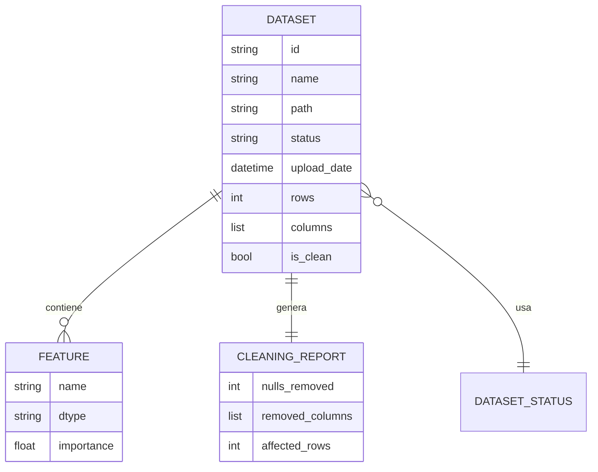

# Mapa de Entidades

**Proyecto**: Sistema de Carga ETL  
**Fase PDCO**: PLAN  

## Dataset

- **Descripcion**: Representa un archivo de datos cargado en el sistema.
- **Atributos UML**:
  - `_id`
  - `_name`
  - `_path`
  - `_status`
  - `_upload_date`
  - `_rows`
  - `_columns`
  - `_is_clean`
- **Operaciones**:
  - `get_dataframe()`
  - `update_status(status)`
- **Relaciones**:
  - Tiene muchas `Feature`.
  - Tiene un `CleaningReport`.
  - Usa `DatasetStatus`.

## DatasetStatus

- **Descripcion**: Enumeracion del ciclo de vida del dataset.
- **Valores**:
  - `RAW`
  - `VALIDATED`
  - `STORED`
  - `CLEANING`
  - `PROFILED`
  - `TRANSFORMED`
  - `UNIFIED`
  - `READY`
  - `ERROR`

## Feature

- **Descripcion**: Representa una columna o caracteristica del dataset.
- **Atributos UML**:
  - `_name`
  - `_dtype`
  - `_importance`
- **Operaciones**:
  - `calculate_importance()`

## CleaningReport

- **Descripcion**: Resume el resultado de limpieza aplicado a un dataset.
- **Atributos UML**:
  - `_nulls_removed`
  - `_removed_columns`
  - `_affected_rows`
- **Operaciones**:
  - `generate_summary()`

## Servicios principales

| Servicio | Responsabilidad |
| --- | --- |
| `IngestionService` | Cargar y validar la existencia del dataset. |
| `CleaningService` | Ejecutar estrategias de limpieza. |
| `FeatureEngineeringService` | Procesar y analizar caracteristicas. |
| `MDMService` | Unificar, estandarizar y deduplicar datasets. |
| `ETLPipelineFacade` | Coordinar el flujo completo del ETL. |

## Interfaces

| Interface | Implementacion esperada |
| --- | --- |
| `IDataRepository` | `PandasRepository` |
| `INotificationService` | `EmailNotificationService` |
| `IDataCleaner` | `NullValueCleaner`, `FormatCleaner`, `DuplicateCleaner` |
| `IFeatureAnalyzer` | `PandasFeatureAnalyzer` |
| `IMDMService` | `PandasMDMService` |

## Diagrama ER Conceptual

