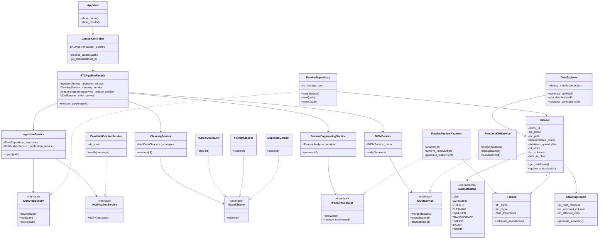

# UML del Sistema

Este documento representa en Mermaid el diagrama UML usado como referencia para el proyecto.

```mermaid
classDiagram
    class AppView {
        +show_menu()
        +show_results()
    }

    class DatasetController {
        -ETLPipelineFacade _pipeline
        +process_dataset(path)
        +get_status(dataset_id)
    }

    class ETLPipelineFacade {
        -IngestionService _ingestion_service
        -CleaningService _cleaning_service
        -FeatureEngineeringService _feature_service
        -MDMService _mdm_service
        +execute_pipeline(path)
    }

    class IngestionService {
        -IDataRepository _repository
        -INotificationService _notification_service
        +ingest(path)
    }

    class CleaningService {
        -list~IDataCleaner~ _strategies
        +execute(df)
    }

    class FeatureEngineeringService {
        -IFeatureAnalyzer _analyzer
        +process(df)
    }

    class MDMService {
        -IMDMService _mdm
        +unify(datasets)
    }

    class IDataRepository {
        <<interface>>
        +save(dataset)
        +load(path)
        +exists(path)
    }

    class INotificationService {
        <<interface>>
        +notify(message)
    }

    class IDataCleaner {
        <<interface>>
        +clean(df)
    }

    class IFeatureAnalyzer {
        <<interface>>
        +analyze(df)
        +remove_irrelevant(df)
    }

    class IMDMService {
        <<interface>>
        +merge(datasets)
        +deduplicate(df)
        +standardize(df)
    }

    class PandasRepository {
        -str _storage_path
        +save(dataset)
        +load(path)
        +exists(path)
    }

    class EmailNotificationService {
        -str _email
        +notify(message)
    }

    class NullValueCleaner {
        +clean(df)
    }

    class FormatCleaner {
        +clean(df)
    }

    class DuplicateCleaner {
        +clean(df)
    }

    class DataExplorer {
        -ndarray _correlation_matrix
        +generate_profile(df)
        +plot_distribution(df)
        +calculate_correlations(df)
    }

    class PandasFeatureAnalyzer {
        +analyze(df)
        +remove_irrelevant(df)
        +generate_statistics(df)
    }

    class PandasMDMService {
        +merge(datasets)
        +deduplicate(df)
        +standardize(df)
    }

    class Dataset {
        -UUID _id
        -str _name
        -str _path
        -DatasetStatus _status
        -datetime _upload_date
        -int _rows
        -list _columns
        -bool _is_clean
        +get_dataframe()
        +update_status(status)
    }

    class Feature {
        -str _name
        -str _dtype
        -float _importance
        +calculate_importance()
    }

    class CleaningReport {
        -int _nulls_removed
        -list _removed_columns
        -int _affected_rows
        +generate_summary()
    }

    class DatasetStatus {
        <<enumeration>>
        RAW
        VALIDATED
        STORED
        CLEANING
        PROFILED
        TRANSFORMED
        UNIFIED
        READY
        ERROR
    }

    AppView --> DatasetController
    DatasetController --> ETLPipelineFacade
    ETLPipelineFacade --> IngestionService
    ETLPipelineFacade --> CleaningService
    ETLPipelineFacade --> FeatureEngineeringService
    ETLPipelineFacade --> MDMService

    IngestionService --> IDataRepository
    IngestionService --> INotificationService
    PandasRepository ..|> IDataRepository
    EmailNotificationService ..|> INotificationService

    CleaningService --> IDataCleaner
    NullValueCleaner ..|> IDataCleaner
    FormatCleaner ..|> IDataCleaner
    DuplicateCleaner ..|> IDataCleaner

    FeatureEngineeringService --> IFeatureAnalyzer
    PandasFeatureAnalyzer ..|> IFeatureAnalyzer
    PandasFeatureAnalyzer --> Feature
    DataExplorer --> Dataset

    MDMService --> IMDMService
    PandasMDMService ..|> IMDMService

    Dataset --> DatasetStatus
    Dataset "1" --> "*" Feature
    Dataset "1" --> "1" CleaningReport
    PandasRepository --> Dataset
```

